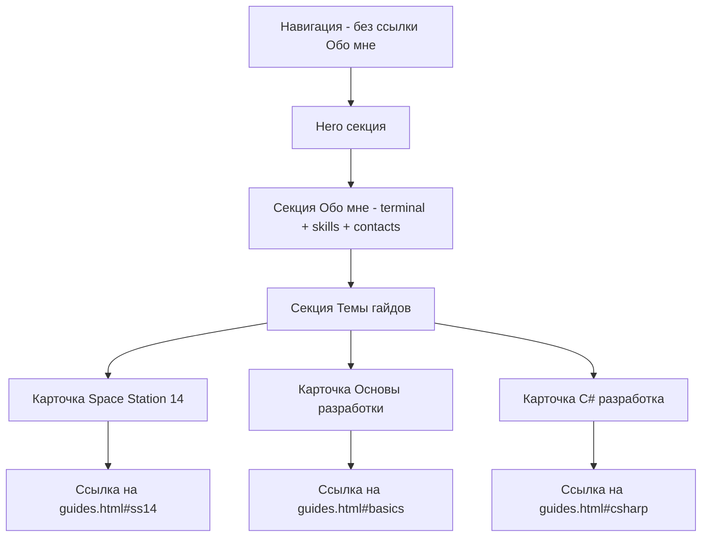
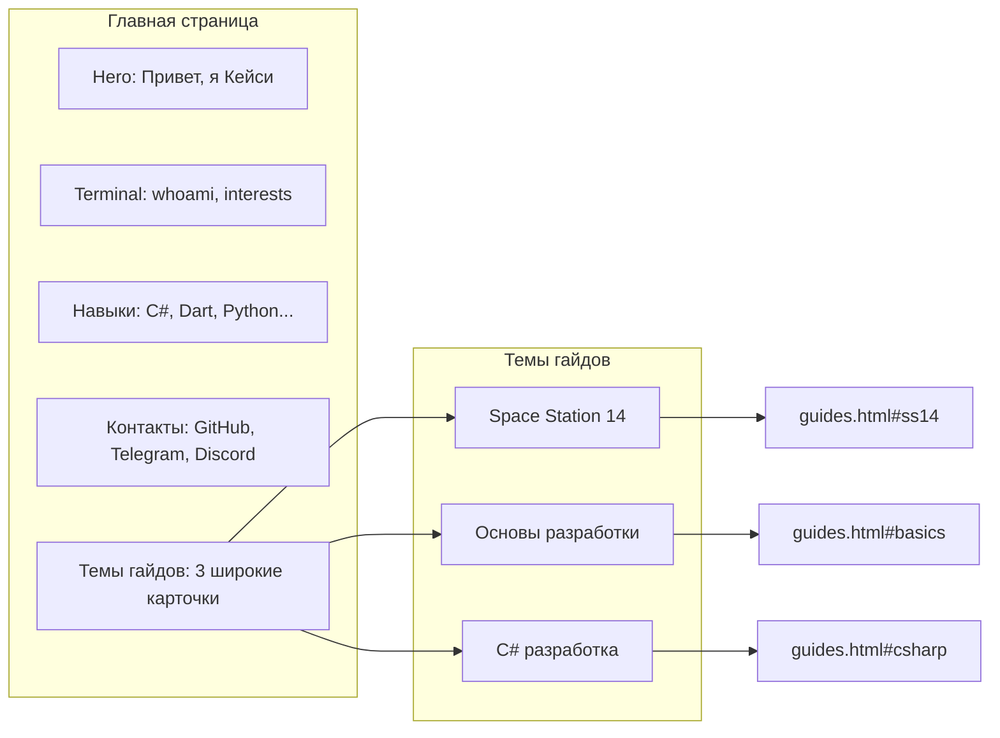

# План редизайна главной страницы

## Обзор задачи

Необходимо объединить страницы "Главная" (index.html) и "Обо мне" (about.html) в одну, а также заменить карточки с последними гайдами на широкие карточки тем, которые ведут на страницу guides.html к конкретным секциям.

---

## Структура новой главной страницы



---

## Шаги реализации

### 1. Добавить ID секциям в guides.html

Добавить якорные идентификаторы к секциям гайдов:

```html
<!-- Было -->
<section class="section">
    <div class="container">
        <h2 class="section__title">Space Station 14</h2>

<!-- Станет -->
<section class="section" id="ss14">
    <div class="container">
        <h2 class="section__title">Space Station 14</h2>
```

Аналогично для:
- `#ss14` - Space Station 14
- `#basics` - Основы разработки  
- `#csharp` - C# разработка

---

### 2. Создать CSS стили для широких карточек тем

Добавить в [`css/style.css`](css/style.css) новый класс для горизонтальных карточек:

```css
/* Topic Cards - широкие горизонтальные карточки */
.topic-card {
    display: flex;
    flex-direction: column;
    padding: 2rem;
    background: var(--bg-secondary);
    border: 1px solid var(--border-color);
    margin-bottom: 1.5rem;
    transition: all 0.3s ease;
}

.topic-card:hover {
    border-color: var(--text-primary);
    box-shadow: var(--glow);
    transform: translateX(5px);
}

.topic-card__header {
    display: flex;
    justify-content: space-between;
    align-items: center;
    margin-bottom: 1rem;
}

.topic-card__title {
    font-size: 1.5rem;
    text-shadow: var(--glow);
}

.topic-card__count {
    color: var(--text-dim);
    font-size: 0.9rem;
}

.topic-card__description {
    color: var(--text-secondary);
    margin-bottom: 1rem;
}

.topic-card__tags {
    display: flex;
    flex-wrap: wrap;
    gap: 0.5rem;
    margin-bottom: 1rem;
}

.topic-card__link {
    align-self: flex-start;
    padding: 0.5rem 1rem;
    border: 1px solid var(--border-color);
    transition: all 0.3s ease;
}

.topic-card__link:hover {
    background: var(--text-primary);
    color: var(--bg-primary);
}
```

---

### 3. Переработать index.html

Новая структура index.html:

```html
<!DOCTYPE html>
<html lang="ru">
<head>
    <!-- Мета-теги -->
    <title>DevGuides // Кейси</title>
</head>
<body>
    <!-- Навигация - БЕЗ ссылки на about.html -->
    <nav class="nav">
        <ul class="nav__links">
            <li><a href="index.html" class="nav__link nav__link--active">Главная</a></li>
            <!-- Убрана ссылка "Обо мне" -->
            <li><a href="projects.html" class="nav__link">Проекты</a></li>
            <li><a href="guides.html" class="nav__link">Гайды</a></li>
        </ul>
    </nav>

    <!-- Hero секция -->
    <section class="hero">
        <h1 class="hero__title">Привет, я Кейси -uO</h1>
        <p class="hero__subtitle">Программист // Математик // Ментор</p>
    </section>

    <!-- Обо мне - из about.html -->
    <section class="section">
        <div class="container">
            <!-- Terminal блок -->
            <div class="terminal">...</div>
        </div>
    </section>

    <!-- Навыки - из about.html -->
    <section class="section">
        <div class="container">
            <h2 class="section__title">Навыки</h2>
            <div class="skills">...</div>
        </div>
    </section>

    <!-- Контакты - из about.html -->
    <section class="section">
        <div class="container">
            <h2 class="section__title">Контакты</h2>
            <div class="contact-links">...</div>
        </div>
    </section>

    <!-- Темы гайдов - новые широкие карточки -->
    <section class="section">
        <div class="container">
            <h2 class="section__title">Темы гайдов</h2>
            
            <!-- Space Station 14 -->
            <a href="guides.html#ss14" class="topic-card">
                <div class="topic-card__header">
                    <h3 class="topic-card__title">Space Station 14</h3>
                    <span class="topic-card__count">3 гайда</span>
                </div>
                <p class="topic-card__description">
                    Изучение от прототипа до Движка с нуля. Прототипы, XAML UI, спрайты.
                </p>
                <div class="topic-card__tags">
                    <span class="tag">SS14</span>
                    <span class="tag">C#</span>
                    <span class="tag">XAML</span>
                    <span class="tag">RobustToolbox</span>
                </div>
                <span class="topic-card__link">[ Перейти к гайдам ]</span>
            </a>

            <!-- Основы разработки -->
            <a href="guides.html#basics" class="topic-card">
                <div class="topic-card__header">
                    <h3 class="topic-card__title">Основы разработки</h3>
                    <span class="topic-card__count">3 гайда</span>
                </div>
                <p class="topic-card__description">
                    Базовые навыки разработчика: Git, терминал, настройка рабочего пространства.
                </p>
                <div class="topic-card__tags">
                    <span class="tag">Git</span>
                    <span class="tag">Terminal</span>
                    <span class="tag">IDE</span>
                </div>
                <span class="topic-card__link">[ Перейти к гайдам ]</span>
            </a>

            <!-- C# разработка -->
            <a href="guides.html#csharp" class="topic-card">
                <div class="topic-card__header">
                    <h3 class="topic-card__title">C# разработка</h3>
                    <span class="topic-card__count">3 гайда</span>
                </div>
                <p class="topic-card__description">
                    От основ языка до создания фреймворков. Файлы, БД, HTTP запросы.
                </p>
                <div class="topic-card__tags">
                    <span class="tag">C#</span>
                    <span class="tag">.NET</span>
                    <span class="tag">SQLite</span>
                </div>
                <span class="topic-card__link">[ Перейти к гайдам ]</span>
            </a>
        </div>
    </section>

    <!-- Footer -->
    <footer class="footer">...</footer>
</body>
</html>
```

---

### 4. Удалить файл about.html

После успешного объединения удалить файл [`about.html`](about.html).

---

### 5. Обновить навигацию во всех файлах

Убрать ссылку на about.html из навигации в:
- [`index.html`](index.html) - уже обновляется
- [`guides.html`](guides.html:39-44)
- [`projects.html`](projects.html)
- [`guides/ss14-prototypes.html`](guides/ss14-prototypes.html)
- [`guides/ss14-xaml-ui.html`](guides/ss14-xaml-ui.html)
- [`guides/guide-template.html`](guides/guide-template.html)

---

### 6. Обновить sitemap.xml

Удалить запись о about.html из [`sitemap.xml`](sitemap.xml).

---

## Файлы для изменения

| Файл | Действие |
|------|----------|
| [`index.html`](index.html) | Полная переработка |
| [`about.html`](about.html) | Удалить |
| [`guides.html`](guides.html) | Добавить ID секциям |
| [`projects.html`](projects.html) | Обновить навигацию |
| [`guides/ss14-prototypes.html`](guides/ss14-prototypes.html) | Обновить навигацию |
| [`guides/ss14-xaml-ui.html`](guides/ss14-xaml-ui.html) | Обновить навигацию |
| [`guides/guide-template.html`](guides/guide-template.html) | Обновить навигацию |
| [`css/style.css`](css/style.css) | Добавить стили topic-card |
| [`sitemap.xml`](sitemap.xml) | Удалить about.html |

---

## Визуализация результата


